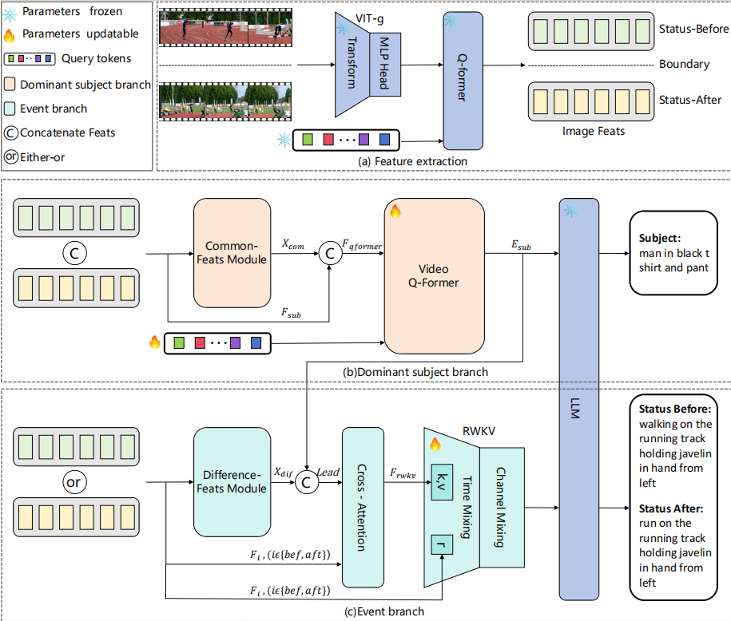

# DIN-GEBC
# Natural Cognizing Video: A Decoupling and Integration Network for General Event Boundary Captioning


## Introduction
1) Decoupling and integration of the general event boundary captioning task:
DIN-GEBC with the dual branch structure is proposed for task decoupling and integration to enable the model to cater
to different descriptive focuses and characteristics. The dominant subject branch guides the event branch, enhancing the interaction between the two branches.
2) Feature decoupling:
DIN-GEBC is equipped with the disentangled features, where the Common-Feats and Difference-Feats modules are used for
extracting shared and differential features to better capture the unchanging information of the subject and the changing information between events, respectively.
3) Enhanced Model Performance:
Experimental results demonstrate that our model outperforms existing models, even with fewer parameters, achieving superior results in the task.


<p align="center" width="100%">
<a target="_blank"></a>
</p>

### Enviroment Preparation 

First, you should create a conda environment:
```
conda env create -f environment.yml
conda activate DIN-GEBC
```


## Prerequisite Checkpoints

Before using the repository, make sure you have obtained the following checkpoints:
- [vit-g](https://huggingface.co/lainxx/eva_vit_g)
- [pretrained BLIP2](https://storage.googleapis.com/sfr-vision-language-research/LAVIS/models/BLIP2/blip2_pretrained_opt2.7b.pth)
- [facebook/opt-2.7b](https://huggingface.co/facebook/opt-2.7b)
  

Remember to change the path of checkpoints `ckpt` in the config file.

## Data
Download the Kinetic-GEBC dataset from https://sites.google.com/view/loveucvpr23/track2.

**For primary visual feature:**
Using [BLIP-2](https://github.com/salesforce/LAVIS/tree/main/projects/blip2) to extract primary visual features. We use `feature_extraction.py` to do so. Remember to change the `video_dir` and `save_dir` in `train_configs/blip2_feature_extract.yaml` before you run:
```
python feature_extraction.py --cfg-path train_configs/blip2_feature_extract.yaml
```
Then, put the extracted features under these three folders:
```
data/features/eva_vit_g_q_former_tokens_12
```


## Training and Validation
Firstly, set the configs in `train_configs/${NAME_OF_YOUR_CONFIG_FILE}.yaml`.
Then run the script
```
CUDA_VISIBLE_DEVICES=${YOUR_GPU_ID} python train.py \
    --cfg-path train_configs/${NAME_OF_YOUR_CONFIG_FILE}.yaml
```
The results can be found in `video_llama/output/`.


